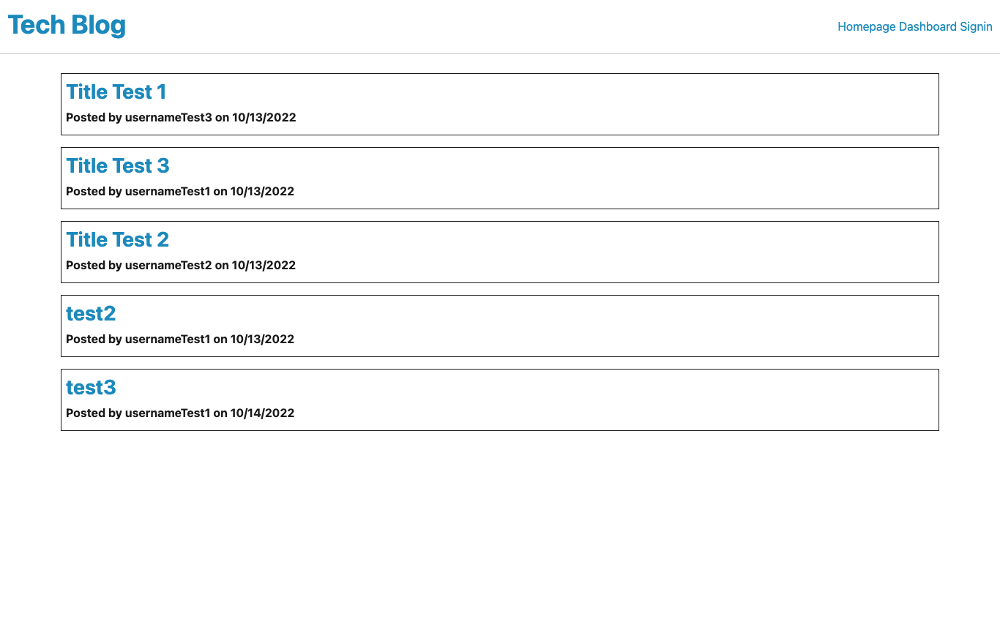

# Tech Blog

## Table of Contents
* [Description](#description)
* [Installation instructions](#installation-instructions)
* [Usage Information](#usage-information)
* [License](#license)
* [Contribution Guidelines](#contribution-guidelines)
* [Test Instructions](#test-instructions)
* [Questions](#questions)

## Description
I created a CMS-style Tech Blog site where developers can publich their blog posts and comment on other developers' posts as well. This app follows the MVC paradigm in its architectural structure, using Handlebars.js as the templating language, Sqeualize as the ORM, and the express-session npm package for authentication. 

After 5 minutes, the application will automatically sign users out, but they can still view posts and comments.

## Installation Instructions
Install Node.js before using this application.

## Usage Information
Deployed Link:[https://sjp-tech-blog.herokuapp.com/]

## License
[MIT](https://opensource.org/licenses/MIT)

## Contribution Guidelines
N/A

## Test Instructions
N/A

## Questions
Have any addition questions? Contact me!
&nbsp;  
GitHub: [sprantis](https://github.com/sprantis)
&nbsp;
Email: sprantis@gmail.com